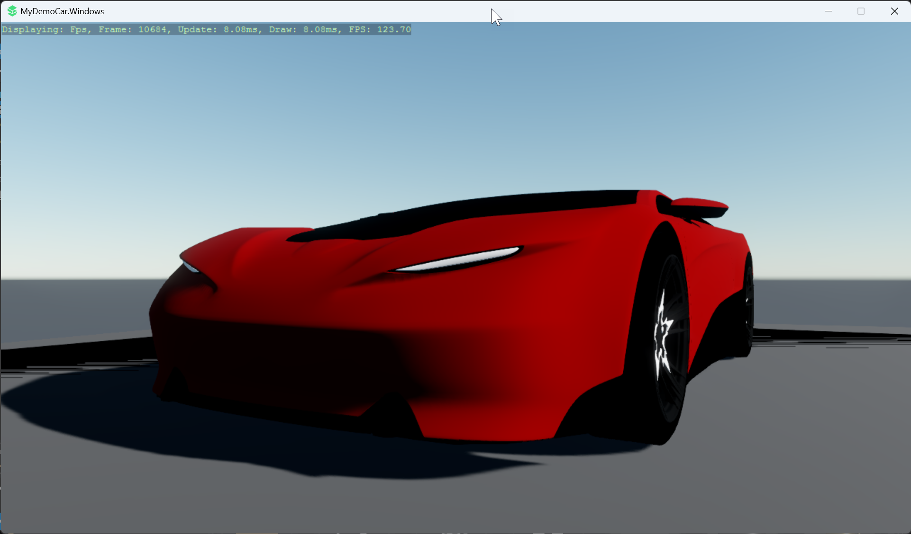
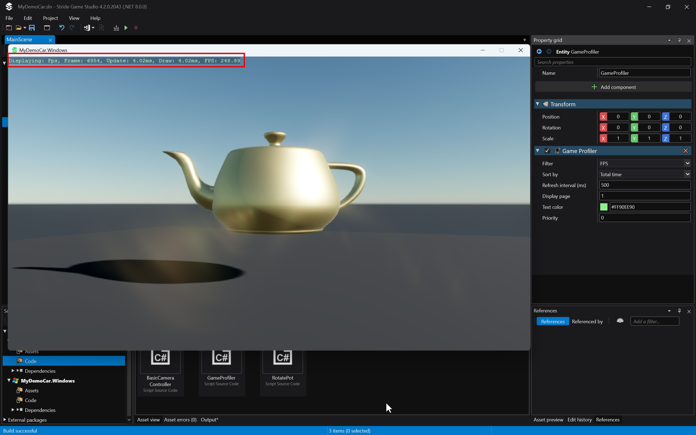

# Stride 3D v4.2 Demo FBX 3D Model Car

Prerequisites:

- **Stride v4.2** : First download and install the installer from <https://www.stride3d.net/download/>
- **FBX Demo 3D Model** : the model is from [Sketchfab - FREE Concept Car 004 - public domain (CC0)](https://sketchfab.com/3d-models/free-concept-car-004-public-domain-cc0-4cba124633eb494eadc3bb0c4660ad7e)

## Screenshots

There's another rotating teapot demo that is using C# script in ***CSharp_script_demo*** git tag and showing FPS in the left top window corner.

